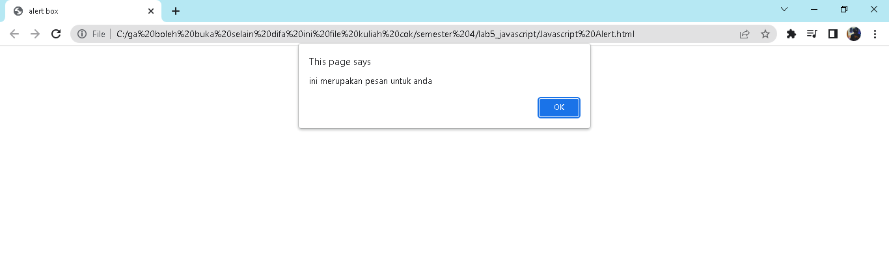
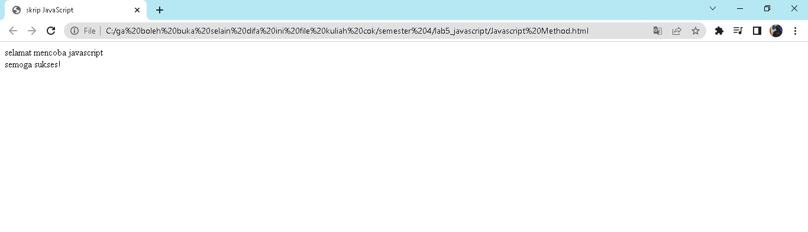
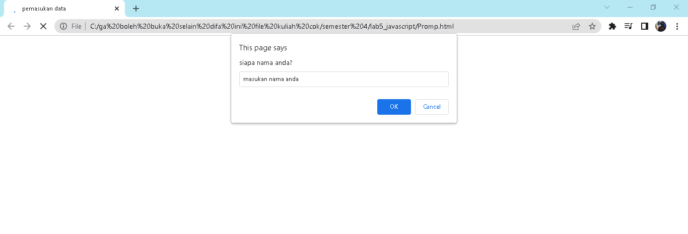
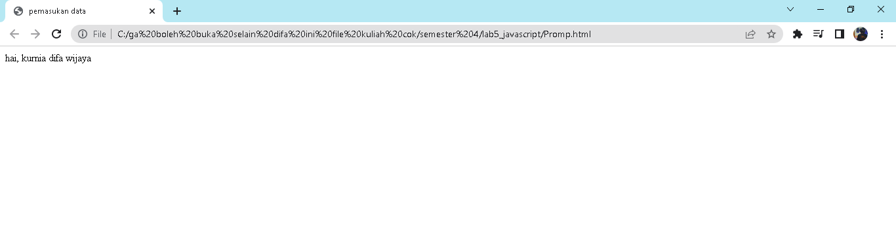

# lab5_javascript
javascript

*nama: kurnia difa wijaa 
*kelas: ti 20b 01 
*nim: 312010024 

* **membuat javascript**

langkah awal yang harus kita lakukan yaitu membuat pengenalan javascript

* **Javascript Alert**

selanjutnya kita membuat Javascript Alert

* **Javascript Method**

selanjutnya membuat Javascript Method 

* **Promp**

selanjutnya kita membuat Promp

Setelah saya mencoba memasukan nama saya kurnia difa wijaya pada kolom prompt tersebut maka halam akan otomatis menampilkan seperti dibawah ini

 

